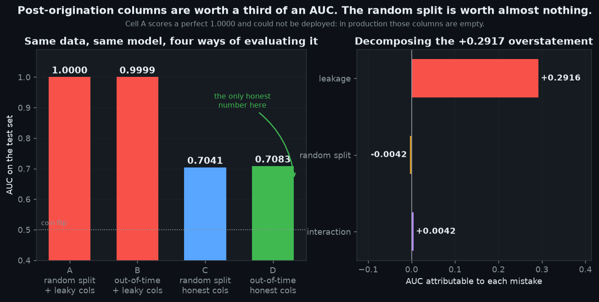
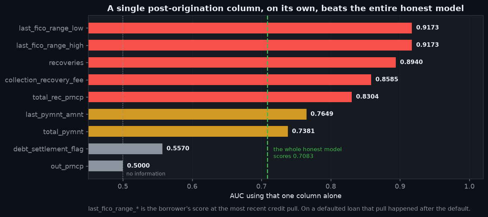
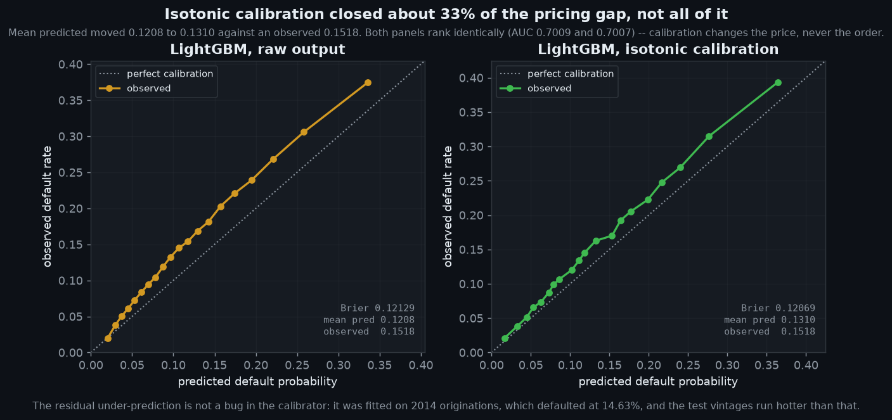
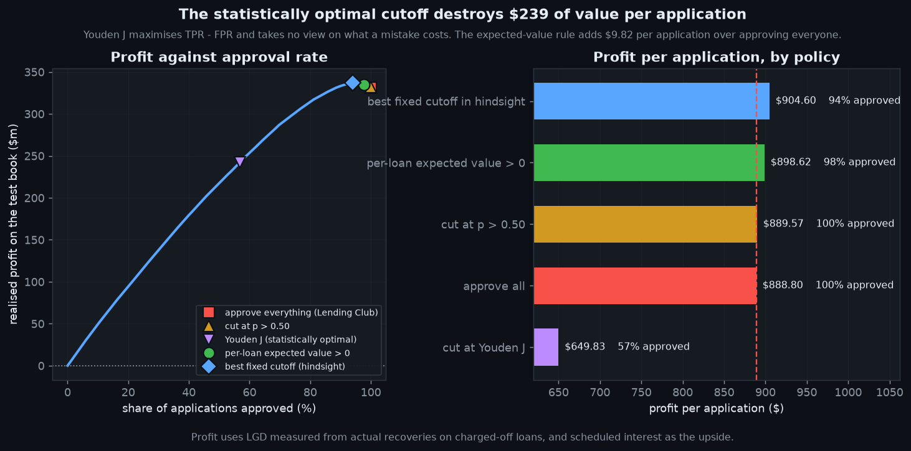
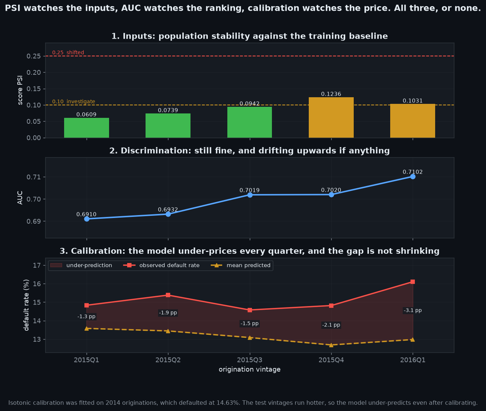

# Consumer credit underwriting, done point-in-time

Probability of default on **779,025 Lending Club loans**, and the lending policy
that follows from it.

The headline finding first, because it is the reason this project exists:

| Configuration | Split | Columns | AUC |
|---|---|---|---|
| **A** careless | random | all, including post-origination | **1.0000** |
| **B** | out-of-time | all, including post-origination | 0.9999 |
| **C** | random | origination only | 0.7041 |
| **D** honest | out-of-time | origination only | **0.7083** |

Cell A is a **perfect classifier**. It is also completely undeployable, because
the columns that make it perfect are empty at the moment an underwriter has to
decide. Cell D is the only number in that table that answers the question a
lender actually asks.



---

## Why I built this

I have spent my career in Machine Learning, and this project is the argument for why that background is worth
something rather than a thing to apologise for.

Search for "Lending Club default prediction" and you will find dozens of
notebooks reporting 0.95 to 0.99 AUC. Almost none of them could be put in front
of a real applicant. The dataset contains 38 columns recorded *after* the money
went out — total payments received, recoveries, settlement amounts, the
borrower's credit score at the most recent bureau pull. Train on those and you
are predicting the past from the future.

Spotting that is not a statistics problem. It is a **lineage** problem: the
feature was recorded downstream of the event it claims to predict. That is the
same instinct as refusing to join a fact table to a dimension snapshot taken
after the fact, and it is exactly what a data engineer has. So the DE background
is the reason the trap gets avoided, and the rest of the repository is the ML.

---

## What is here

```
src/
  columns.py            the point-in-time contract: all 151 columns classified
  config.py             paths, seed, and the two population rules
  get_data.py           resumable ranged download, SHA-256 verified
  build_warehouse.py    DuckDB load and the modelling population
  features.py           contract-restricted feature matrix
  leakage_experiment.py the 2x2 above
  scorecard.py          WOE / IV binning and a points-based scorecard
  cost.py               loss given default, and expected-value decisioning
  train.py              baseline -> scorecard -> LightGBM -> calibration -> policy
  drift.py              PSI, characteristic analysis, performance by vintage
  monitor.py            monitoring run and the champion/challenger gate
  charts.py             the five figures
  report.py             the PDF summary
  serve.py              FastAPI scoring service
app/
  streamlit_app.py      interactive demo
tests/                  45 tests, including the leakage guard
docs/
  credit-risk-summary.pdf   four-page write-up
  00-goal-and-why.md        what I set out to prove
  modelling.md              the modelling decisions in detail
  mlops.md                  serving, monitoring, promotion
  decision-log.md           every judgement call, including the wrong ones
```

Run it:

```bash
pip install -r requirements.txt
make all          # download (1.56 GB, resumable), build, experiment, train, monitor
make app          # the interactive demo
make api          # the scoring service on :8000
make test         # 45 tests
```

`make sample` does the same on a 200k-row slice if you want to see it work
without the full download.


## The centrepiece: a contract, not a convention

Every one of the 151 source columns is classified in `src/columns.py` with a
written reason:

```python
"recoveries": (OUTCOME, "post-charge-off recovery; non-zero only if it defaulted"),
"chargeoff_within_12_mths": (ORIGINATION,
                             "charge-offs on OTHER accounts pre-application"),
"last_fico_range_high": (OUTCOME, "FICO at latest pull, i.e. after the outcome"),
"zip_code": (SENSITIVE, "3-digit ZIP; recognised proxy for race under ECOA"),
```

| Category | Count | Meaning |
|---|---|---|
| ORIGINATION | 102 | known at underwriting; a model may use it |
| OUTCOME | 38 | recorded during or after servicing; using it is leakage |
| SENSITIVE | 2 | known, but excluded on fair-lending grounds |
| DROP | 7 | constant, empty, free text, or an identifier |
| LABEL / META | 2 | the target, and the date the split uses |

Two things make this a contract rather than a comment:

```python
check_coverage(source_columns)   # fails if a column is unreviewed
assert_no_leakage(feature_names) # fails if an OUTCOME column reaches the model
```

If Lending Club's mirror ever gains a column, the pipeline **stops** instead of
quietly letting an unclassified field into the model. Both guards are tested for
actually firing — a check that never fails is decoration.

`chargeoff_within_12_mths` is the interesting one in the other direction. It
sounds like an outcome and is not: it counts charge-offs on the borrower's
*other* accounts before this loan existed. Excluding it would throw away real
signal for no reason. Over-correcting is its own mistake.


## The subtle trap



`last_fico_range_high` scores **0.9173 entirely on its own** — better than
`recoveries` at 0.8940. It is the borrower's credit score at the *most recent*
bureau pull, which on a defaulted loan happened after the default wrecked it. It
is not a payment field, it sits in the middle of a block of legitimate FICO
columns, and sorted alphabetically it lands right next to `fico_range_high`.
That is exactly how it ends up in a feature list by accident.

`out_prncp` scores a flat **0.5000** — leaky in principle, inert here, because
in a matured population outstanding principal is always zero. Worth saying
rather than hiding.


## A prediction of mine that was wrong

I expected the random train/test split to inflate the score too. It did the
opposite: **−0.0042**. The random split was very slightly *harder*.

The mechanism is my own population rule. Requiring every loan to have had its
full contractual term before the snapshot removes the 2017 and 2018 vintages
entirely, and what remains defaults at 14–16% in every single year from 2010 to
2016. There is almost no temporal drift left for a random split to exploit.

It stays in the write-up as a failed hypothesis with the mechanism explained. It
makes the leakage result more credible, not less — one claim held spectacularly,
the other did not, and both were measured the same way.


## The population is smaller than it looks, on purpose

| Stage | Loans | Removed |
|---|---|---|
| All loans in the extract | 2,260,701 | |
| Resolved outcome only | 1,348,059 | 912,642 still in flight |
| Had full term before snapshot | **779,025** | 569,034 not yet matured |
| Charged off | 118,371 | **15.19% default rate** |

Keeping only resolved loans is not enough. A 60-month loan issued in 2017 cannot
appear as *Fully Paid* in a 2018 Q4 extract — it has not had time. Filtering on
resolved status alone therefore keeps recent vintages **only if they defaulted
early**. Survivorship bias, pointing the wrong way.

The maturity rule keeps 100% of 2013 originations, 30.6% of 2016, and **none at
all** of 2017 and 2018. Losing a quarter of a million recent loans hurts and it
is still correct.


## Models, and what each one is for

| Model | AUC | Gini | KS | Brier |
|---|---|---|---|---|
| Constant baseline | 0.5000 | 0.0000 | — | 0.12877 |
| WOE scorecard (27 variables) | 0.6892 | 0.3783 | 0.2752 | 0.12146 |
| LightGBM | 0.7009 | 0.4019 | 0.2919 | 0.12129 |
| LightGBM, isotonic calibrated | 0.7007 | 0.4014 | 0.2918 | **0.12069** |

**Accuracy is deliberately not reported.** At a 15% default rate, predicting
that everybody repays scores 85% and is worthless.

The scorecard is not a warm-up exercise. A US lender has to send an adverse
action notice stating *why* an application was declined, in specific reasons.
"The 340-tree ensemble assigned you a high score" is not a reason. So the
scorecard is built properly — quantile bins, weight of evidence, IV selection, a
points table scaled so that 20 points doubles the odds — and the API returns the
bins that cost an applicant the most points.



Calibration improves Brier while leaving AUC untouched, which is the point:
**calibration changes the price, never the order.** It only closes about a third
of the gap, and the reason is honest — isotonic was fitted on 2014 originations,
which defaulted at 14.63%, and the test vintages run hotter.


## A probability is not a decision

Approving a loan is worth `(1−p)·interest − p·LGD·exposure`, so it is worth
doing while

```
p  <  interest / (interest + LGD · exposure)
```

That break-even is **a property of the individual loan, not a global constant**.
A 60-month loan at 26% earns far more interest than a 36-month loan at 7% and
can therefore carry far more risk. Every "we chose a threshold of 0.5" notebook
is implicitly claiming otherwise.

Loss given default is **measured, not assumed** — from actual recoveries on
loans that charged off: mean 0.539, median 0.562. This is the one place the
post-origination columns are the right tool. Using them as features predicts the
future from the future; using them to measure what past defaults cost is just
accounting. Same columns, opposite verdict, and the difference is the direction
of time.

| Policy | Approved | Book bad rate | Profit / application |
|---|---|---|---|
| approve all (what Lending Club did) | 100.0% | 15.18% | $888.80 |
| cut at p > 0.50 | 100.0% | 15.17% | $889.57 |
| cut at Youden J | 56.8% | 8.57% | **$649.83** |
| per-loan expected value > 0 | 97.6% | 14.70% | **$898.62** |
| best fixed cutoff, in hindsight | 94.0% | 13.80% | $904.60 |



Two results worth pausing on.

**The statistically optimal cutoff is a disaster.** Youden's J maximises
TPR − FPR, declines 43% of applications, and destroys **$239 of value per
application** against simply approving everyone. It is optimal with respect to a
criterion that takes no view on what a mistake costs.

**`p > 0.50` does nothing at all.** Not one application in 372,810 has a
predicted probability above 0.5, so the industry-default threshold approves the
entire book. It is not a conservative choice; it is not a choice.

The expected-value rule adds **$9.82 per application**, about 1.1%. That figure
deserves context rather than spin: every loan here was *already approved* by
Lending Club's own underwriting, so the model is finding residual risk among
applicants who already passed a credit screen. The easy declines happened
upstream and are not in the data.


## Monitoring: three signals that disagree



| Signal | What it says |
|---|---|
| Score PSI | rises 0.0609 → 0.1236, crossing the 0.10 "investigate" line |
| AUC | **improves** 0.6910 → 0.7102 — discrimination is fine |
| Calibration | under-predicts every quarter, gap widening 1.3 → 3.1 pp |

Any one of these alone gives the wrong answer. PSI alone says retrain. AUC alone
says relax. Only together do they say what is actually true: the model still
ranks well but is systematically under-pricing, and the fix is recalibration,
not retraining.

The most-shifted variable is `initial_list_status` at PSI 0.4904 — which records
whether Lending Club listed a loan whole or fractionally. That is a change in
**their own platform operations**, not in borrower quality. Reacting to it by
retraining would be solving the wrong problem, and per-variable PSI is precisely
what tells you so.

### The promotion gate

The scorecard was run as a challenger against the LightGBM champion:

```
[FAIL] discrimination        AUC 0.6892 vs 0.7007 (tolerance 0.0020)
[FAIL] calibration           Brier 0.12146 vs 0.12069 (tolerance 0.00050)
[FAIL] profit                $332.1m vs $335.0m
[PASS] population stability  0 vintage(s) flagged as shifted

decision: KEEP CHAMPION
```

So interpretability costs **0.012 AUC and 0.86% of profit** on a $335m book.
That is a number a credit committee can accept or reject, which is considerably
more useful than an opinion about interpretability. Failing the gate is the
expected outcome most of the time — that is the point of having one.


## Serving

```bash
make api
curl -X POST localhost:8000/score -H 'content-type: application/json' -d '{
  "loan_amnt": 15000, "term_months": 36, "int_rate": 12.5,
  "annual_inc": 65000, "dti": 18.2, "fico_range_low": 690,
  "fico_range_high": 694, "grade": "C", "credit_history_months": 168
}'
```

```json
{
  "probability_of_default": 0.134,
  "breakeven_probability": 0.291,
  "expected_value": 1783.2,
  "recommendation": "approve",
  "scorecard_points": 612.4,
  "fields_supplied": 9,
  "fields_defaulted": 96,
  "adverse_action_reasons": [...]
}
```

The response reports how many fields were **defaulted**, because a score built
from nine supplied values and ninety-six training medians deserves less trust
than one built from a full application, and the caller should be able to see the
difference.

A test asserts that sending `recoveries` through the free-form `extra` field
**cannot change the prediction** — the API must not become a back door around
the contract.

The Dockerfile deliberately does **not** bake the model in; it is mounted at run
time, and `/health` returns 503 rather than crashing when it is absent. A
container that dies because its artefact is missing is much harder to diagnose
in a cluster than one that says why.

> Docker is not installed on the machine I built this on, so the image is built
> and smoke-tested by GitHub Actions rather than locally. CI starts the
> container with no model mounted and asserts `/health` answers.


## Honest limitations

- **Selection bias is unavoidable here.** Every loan in this file was approved
  by Lending Club. The applicants they declined are not in the data, so the
  model is trained on a pre-screened population and the achievable profit lift
  is correspondingly modest. Reject inference is the standard remedy and is not
  implemented.
- **The maturity rule costs a quarter of a million loans.** Survival modelling
  of time-to-default would let it be relaxed.
- **Calibration is fitted on a fixed 2014 slice.** Monitoring shows this is
  already stale; a rolling recalibration on the most recent closed book is the
  obvious fix.
- **Geography is excluded, and that is not free.** `zip_code` and `addr_state`
  carry genuine signal. They are out because ECOA treats geography as a proxy
  for protected characteristics, and a model that declines people for their
  postcode is a redlining problem regardless of its AUC.
- **The economics are simplified.** One pooled LGD, scheduled interest as the
  upside, no funding cost, no prepayment, no discounting. Each is a real
  omission; none changes the ranking of the policies.


## Data

Lending Club accepted loans, 2007 through 2018 Q4. 2,260,701 rows, 151 columns,
1.56 GB, SHA-256 `3eae03c2…` verified at download. Lending Club took their own
download page offline years ago; the mirror used is recorded in `src/config.py`,
and the download fails loudly if the remote file ever changes size, because
every number in this README was measured against the file as it is.
