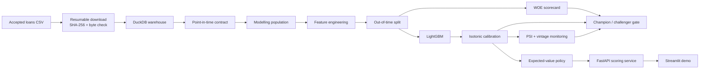

<div align="center">

# Credit Risk Underwriting

### A point-in-time, production-minded credit decisioning system

<p>
  
  
  
  
  
  
  
  
  
  
  
  
</p>

Predict default risk using only information available **before a loan is funded** — then turn that probability into a loan-specific approval decision, an explainable score, and a monitoring signal.

<p>
  <strong>779,025</strong> matured loans · <strong>105</strong> modelling features · <strong>0.7007</strong> honest out-of-time AUC
</p>

<p>
  <a href="#quick-start">Quick start</a> ·
  <a href="#why-this-project-exists">Why this exists</a> ·
  <a href="#system-design">System design</a> ·
  <a href="#results">Results</a> ·
  <a href="#serving">Serving</a>
</p>

</div>

---

## The short version

This is not just a notebook that predicts loan defaults. It is a complete credit-risk workflow built around one question:

> **Would this feature actually exist at the moment an underwriter has to decide?**

The project takes the Lending Club accepted-loan dataset from raw CSV to a working underwriting service. It builds a point-in-time data contract, creates a leakage-resistant modelling population, compares an interpretable WOE scorecard with LightGBM, calibrates probabilities, calculates expected value for each loan, serves decisions through FastAPI, and monitors drift over time.

The headline result is also the central lesson:

| Setup | Split | Features | AUC | Deployable? |
|---|---|---|---:|---|
| Careless | Random | All columns, including post-origination data | **1.0000** | No |
| Careless | Out-of-time | All columns, including post-origination data | 0.9999 | No |
| Clean | Random | Origination-only data | 0.7041 | Almost |
| **Honest** | **Out-of-time** | **Origination-only data** | **0.7083** | **Yes** |

A perfect score can be completely useless. The model only matters if it can make the same decision in production that it made during evaluation.


---

## Why this project exists

“Predict loan defaults with machine learning” is one of the most common portfolio projects. It is also one of the easiest places to accidentally build a model that could never work in the real world.

The Lending Club extract contains 151 columns. Many of them describe what happened **after** the loan was issued:

- payments received
- recoveries after charge-off
- settlement amounts
- hardship programmes
- the borrower’s most recent credit score

Those columns make the prediction look impressive because they reveal the outcome. But they are empty when the application is being reviewed.

That is not primarily a modelling mistake. It is a **data-lineage mistake**.

A feature recorded after the event cannot be used to predict that event. This project treats that rule as executable code instead of a comment in a notebook. Every source column is classified, every feature matrix is checked, and the pipeline stops when the data shape changes unexpectedly.

The machine-learning work is important. The time-awareness comes first.

---

## What the system does



The project is deliberately organised as a system rather than a single training script:

1. **Acquire the data safely.** The download resumes after interruption and verifies the expected file size and SHA-256 hash.
2. **Build a warehouse.** DuckDB reads and filters the 1.56 GB extract without pulling everything into pandas memory.
3. **Define the population honestly.** Only resolved loans with enough time to complete their contractual term are labelled.
4. **Enforce point-in-time correctness.** Every one of the 151 source columns gets a category and a reason.
5. **Engineer a small, defensible feature set.** Derived features have a reason for existing; missing values are not silently invented away.
6. **Evaluate forward in time.** Training, calibration, and test windows are separated by origination date.
7. **Train two useful kinds of model.** LightGBM provides strong ranking performance; the scorecard provides readable adverse-action reasons.
8. **Make an economic decision.** The approval threshold changes with the loan’s interest, term, exposure, and LGD.
9. **Serve and monitor it.** The API returns a decision, not just a probability, while PSI, calibration, AUC, and profit feed the promotion gate.

---

## The point-in-time contract

The most important file in the repository is [`src/columns.py`](src/columns.py).

Every source column is classified as one of:

| Category | Count | Meaning |
|---|---:|---|
| `ORIGINATION` | 102 | Known when the application is underwritten |
| `OUTCOME` | 38 | Recorded during or after servicing; forbidden as a feature |
| `SENSITIVE` | 2 | Known at origination, but excluded for fair-lending reasons |
| `DROP` | 7 | Constant, empty, free text, or an identifier |
| `LABEL / META` | 2 | The target and the date used for splitting |

The contract is enforced in two directions:

```python
check_coverage(source_columns)
# Stops the pipeline when an upstream extract adds or removes a column.

assert_no_leakage(feature_names)
# Stops training when an OUTCOME column reaches the feature matrix.
```

Both checks have tests that prove they fail when they should. A guard that never gets tested in its failure mode is not really a guard.

The project also avoids the opposite mistake. `chargeoff_within_12_mths` sounds like a target-related field, but it describes charge-offs on the borrower’s **other accounts before this loan existed**. It is legitimate origination-time information and stays in the model.

Geography is handled separately. `zip_code` and `addr_state` carry signal, but they are excluded as sensitive proxy variables. Improving AUC is not a sufficient reason to build a postcode-based decline policy.

---

## The modelling population

The raw file contains 2,260,701 loans. The final population is smaller by design:

| Stage | Loans | Why rows leave |
|---|---:|---|
| Raw extract | 2,260,701 | — |
| Resolved outcomes | 1,348,059 | 912,642 loans are still in flight |
| Full contractual term completed | **779,025** | 569,034 loans have not matured |
| Charged off | 118,371 | **15.19% default rate** |

A resolved-status filter alone is not enough. A 60-month loan issued in 2017 cannot be “Fully Paid” in a 2018 Q4 snapshot unless something unusual happened. Keeping those rows would preferentially retain loans that defaulted early and create survivorship bias.

The maturity rule removes the 2017 and 2018 vintages entirely. That costs data, but it avoids pretending that an unfinished loan has a known outcome.

The split is also time-based:

```text
fit         230,706 loans   2007-06 to 2013-12
calibrate   175,509 loans   2014-01 to 2014-12
test        372,810 loans   2015-01 to 2016-03
```

There is no random mixing of future vintages into the past. That is closer to how the model will actually be used.

---

## Feature engineering without feature theatre

The feature pipeline starts from the contract-approved origination columns and adds only features that can be explained:

| Feature | Why it exists |
|---|---|
| `fico` | Converts the five-point FICO band into its midpoint |
| `loan_to_income` | Measures the new loan relative to stated income |
| `installment_to_income` | Captures the annual payment burden |
| `revol_util_calc` | Recomputes utilisation when the source value is missing |
| `emp_length_years` | Converts the ordered employment text into a number |
| `is_thin_file` | Distinguishes short credit histories from established ones |
| `has_derogatory` | Summarises sparse derogatory indicators |

Missing values are kept meaningful. LightGBM can route `NaN` values through their own branches, and the scorecard gives missing values their own WOE bin. A missing value is not automatically the median of an imaginary borrower.

Categorical variables remain categorical. LightGBM handles them natively, and category levels are frozen from the training matrix before they are reused for testing and serving.

The final model matrix contains **105 features**. When Lending Club’s own `grade`, `sub_grade`, and `int_rate` are removed, the project can measure how much performance comes from independently learning borrower risk rather than agreeing with Lending Club’s existing underwriting system.

---

## Models and results

| Model | AUC | Gini | KS | Brier |
|---|---:|---:|---:|---:|
| Constant baseline | 0.5000 | 0.0000 | — | 0.12877 |
| WOE scorecard, 27 variables | 0.6892 | 0.3783 | 0.2752 | 0.12146 |
| LightGBM | 0.7009 | 0.4019 | 0.2919 | 0.12129 |
| **LightGBM + isotonic calibration** | **0.7007** | **0.4014** | **0.2918** | **0.12069** |

Accuracy is intentionally missing. With a 15% default rate, predicting “everyone repays” already produces 85% accuracy. That number says almost nothing about whether the model is useful.

### Why both a scorecard and LightGBM?

The scorecard is not included as a beginner exercise. It addresses a real credit requirement: a lender must be able to explain why an application was declined.

The scorecard uses:

- quantile bins for skewed credit variables
- explicit missing-value bins
- rare-category collapsing
- weight of evidence and information value
- Laplace smoothing to avoid infinite values
- L2-regularised logistic regression
- points scaled so 20 points doubles the odds

The scorecard reaches most of LightGBM’s ranking power with 27 readable variables. LightGBM wins the benchmark, but the difference is measured rather than hand-waved.


Calibration improves the probability estimate without changing the ranking:

> **Calibration changes the price, not the order.**

The calibrated model still under-predicts later vintages because it was calibrated on 2014, whose default rate was 14.63%, while the test vintages run hotter. That limitation is visible in monitoring instead of being hidden behind a prettier chart.

---

## From probability to an underwriting decision

A probability of default is not a decision by itself.

For a loan, the expected value is approximately:

```text
(1 - p) × interest_if_paid - p × LGD × exposure
```

Approve while:

```text
p < interest / (interest + LGD × exposure)
```

That break-even probability belongs to the **loan**, not the model globally. A high-rate, longer-term loan can tolerate more risk than a short, low-rate loan because it earns more interest.

The project estimates LGD from observed recoveries on charged-off loans rather than assuming a convenient number. Importantly, post-origination fields are used for measuring historical cost, not for predicting future outcomes. The direction of time is what changes the interpretation.

| Policy | Approved | Book bad rate | Profit / application |
|---|---:|---:|---:|
| Approve all — the historical policy | 100.0% | 15.18% | $888.80 |
| Fixed cutoff at `p > 0.50` | 100.0% | 15.17% | $889.57 |
| Youden’s J cutoff | 56.8% | 8.57% | **$649.83** |
| Per-loan expected value > 0 | 97.6% | 14.70% | **$898.62** |
| Best fixed cutoff in hindsight | 94.0% | 13.80% | $904.60 |


The statistically attractive cutoff is not the economically attractive one. Youden’s J declines 43% of applications and destroys $239 per application relative to approving everyone.

The expected-value policy adds $9.82 per application, about 1.1%. That gain should not be oversold: every loan in this dataset was already approved by Lending Club. The easy declines are missing, so this model is finding residual risk inside an already screened population.

---

## Monitoring and model promotion

The monitoring layer asks three different questions:

1. **Did the population move?** Score PSI by vintage and variable-level characteristic analysis.
2. **Can the model still rank risk?** AUC by vintage.
3. **Are the probabilities priced correctly?** Observed versus predicted default rates.

Those signals disagree, which is why all three are needed:

| Signal | Finding | Interpretation |
|---|---|---|
| Score PSI | 0.0609 → 0.1236 | Investigate population movement |
| AUC | 0.6910 → 0.7102 | Ranking remains healthy |
| Calibration | Under-predicts by 1.3 → 3.1 pp | Recalibration is needed |

The largest variable shift is `initial_list_status` at PSI 0.4904. That represents a change in Lending Club’s listing operations, not necessarily a change in borrower quality. Retraining immediately would solve the wrong problem.

The promotion gate compares the interpretable scorecard challenger with the LightGBM champion:

```text
[FAIL] discrimination        AUC 0.6892 vs 0.7007
[FAIL] calibration           Brier 0.12146 vs 0.12069
[FAIL] profit                $332.1m vs $335.0m
[PASS] population stability  0 vintage(s) flagged as shifted

decision: KEEP CHAMPION
```

The scorecard’s interpretability costs 0.012 AUC and 0.86% of profit on a $335m book. That is a trade-off a credit committee can discuss with numbers instead of opinions.

---

## Serving

The FastAPI service exposes two endpoints:

- `GET /health` — reports whether the model artefact is available and what it contains
- `POST /score` — returns a complete decision for one application

The response includes the model probability, the loan-specific break-even probability, expected value, recommendation, scorecard points, defaulted-field count, and adverse-action reasons.

```bash
make api
```

```bash
curl -X POST http://localhost:8000/score \
  -H 'content-type: application/json' \
  -d '{
    "loan_amnt": 15000,
    "term_months": 36,
    "int_rate": 12.5,
    "annual_inc": 65000,
    "dti": 18.2,
    "fico_range_low": 690,
    "fico_range_high": 694,
    "grade": "C",
    "credit_history_months": 168
  }'
```

Example response:

```json
{
  "probability_of_default": 0.134,
  "breakeven_probability": 0.291,
  "expected_value": 1783.2,
  "recommendation": "approve",
  "scorecard_points": 612.4,
  "fields_supplied": 9,
  "fields_defaulted": 96,
  "adverse_action_reasons": []
}
```

The API accepts a practical subset of application fields. Missing fields fall back to training-set medians or modes, but the response tells the caller how much defaulting occurred.

The free-form `extra` field is not a leakage back door. A test confirms that sending `recoveries` or `last_fico_range_high` cannot change the prediction.

The Docker image is intentionally small and production-oriented:

- Python 3.12 slim base
- serving dependencies only
- LightGBM’s OpenMP runtime installed explicitly
- non-root `scorer` user
- model mounted at runtime instead of baked into the image
- `/health` returns 503 with a useful message when the model is absent

```bash
docker build -t credit-risk .
docker run -p 8000:8000 \
  -v "$(pwd)/data/models:/app/data/models:ro" \
  credit-risk
```

---

## Interactive demo

The Streamlit application puts the project’s main ideas in one place:

- score an application
- inspect adverse-action reasons
- see the leakage experiment
- move the approval cutoff and watch profit change
- inspect drift, calibration, and the promotion gate

```bash
make app
```

Then open the local Streamlit URL shown in your terminal.

---

## Tech stack

### Data and storage

- **Python 3.12** — primary language and runtime
- **DuckDB** — local analytical warehouse and memory-efficient CSV filtering
- **Pandas / NumPy** — feature engineering and numerical work
- **PyArrow** — columnar data support

### Machine learning

- **LightGBM** — gradient-boosted decision trees with native categorical features
- **scikit-learn** — calibration, metrics, validation utilities, and model evaluation
- **SciPy** — scientific computing support
- **Custom WOE scorecard** — explainable credit scoring and adverse-action reasons

### MLOps and delivery

- **MLflow** with a local SQLite backend — parameters, metrics, and artefacts
- **FastAPI + Pydantic** — typed scoring API and request validation
- **Uvicorn** — ASGI server
- **Docker** — minimal serving container with runtime model mounting
- **Streamlit** — interactive model and monitoring demo
- **pytest** — contract, modelling, API, and economics tests
- **Ruff** — linting
- **Make** — reproducible pipeline commands

---

## Repository map

```text
.
├── src/
│   ├── columns.py             point-in-time data contract and leakage guards
│   ├── config.py              paths, constants, source URL, population rules
│   ├── get_data.py            resumable download with integrity checks
│   ├── build_warehouse.py     raw DuckDB table and matured population
│   ├── features.py            parsing, derived features, matrix construction
│   ├── leakage_experiment.py  controlled 2x2 leakage experiment
│   ├── scorecard.py            WOE / IV binning and points-based scorecard
│   ├── cost.py                LGD, expected value, and policy economics
│   ├── train.py               fit, calibrate, evaluate, and persist models
│   ├── drift.py               PSI and vintage-level monitoring calculations
│   ├── monitor.py              champion/challenger promotion gate
│   ├── charts.py              reproducible project figures
│   ├── report.py              PDF report generation
│   └── serve.py               FastAPI health and scoring endpoints
├── app/
│   └── streamlit_app.py       interactive underwriting and monitoring demo
├── tests/
│   ├── test_contract.py       point-in-time and leakage protection
│   ├── test_modelling.py      WOE, PSI, feature, and economics invariants
│   └── test_api.py            request validation and serving behaviour
├── docs/
│   ├── 00-goal-and-why.md     project motivation and claims
│   ├── modelling.md            population, features, models, and results
│   ├── mlops.md               serving, monitoring, CI, and promotion
│   ├── decision-log.md        decisions, trade-offs, and failed hypotheses
│   └── assets/                 generated charts used by the docs and demo
├── Dockerfile                 production-style scoring image
├── Makefile                   end-to-end developer commands
├── pyproject.toml             package metadata, Ruff, and pytest settings
└── requirements.txt            pinned runtime and development dependencies
```

---

## Quick start

### Option 1: see the full pipeline

The full dataset is approximately 1.56 GB. The download is resumable, so an interrupted run can continue rather than starting over.

```bash
git clone https://github.com/sagarkumarmishra/credit-risk-underwriting.git
cd credit-risk-underwriting

python -m venv .venv
source .venv/bin/activate        # Windows: .venv\Scripts\activate

pip install -r requirements.txt
make all
```

`make all` runs:

```text
Download → DuckDB warehouse → leakage experiment → training → monitoring → charts → PDF report
```

### Option 2: try it quickly on a sample

```bash
make sample
```

This exercises the same code paths using a 200k-row slice. The published numbers in the README come from the full dataset.

### Run the individual stages

```bash
make data       # download and verify the raw dataset
make warehouse  # build DuckDB tables and the modelling population
make leakage    # run the 2x2 leakage experiment
make train      # baseline, scorecard, LightGBM, calibration, policy
make monitor    # PSI, performance by vintage, promotion gate
make charts     # regenerate figures
make report     # build the PDF summary
make test       # run the test suite
make lint       # run Ruff
make api        # start FastAPI on port 8000
make app        # start Streamlit
make mlflow     # open local MLflow history
```

---

## Tests that protect the important parts

The test suite is designed around failures that can produce plausible-looking but wrong results:

| Test area | What it protects |
|---|---|
| Contract coverage | New or missing source columns cannot pass silently |
| Leakage guard | Post-origination fields cannot enter the feature matrix |
| Origination classification | Legitimate bureau fields are not over-excluded |
| WOE direction | Safer bins receive the correct sign |
| PSI bin edges | New distributions are compared against baseline bins |
| Expected-value algebra | Approval flips at the correct break-even probability |
| Feature arithmetic | Zero income becomes unknown rather than infinity |
| API validation | Impossible loan applications are rejected |
| Serving contract | Minimal requests return a declared level of defaulting |
| Monotonicity | A clearly worse credit file does not score as safer |
| Leakage through `extra` | Free-form API inputs cannot bypass the contract |

Run them with:

```bash
make test
```

---

## What I learned

Three conclusions survived the work:

1. **Leakage is a lineage problem before it is a modelling problem.** The perfect model was the least useful model in the experiment.
2. **AUC is not the deliverable.** A probability only becomes useful when it is calibrated and connected to the economics of the individual loan.
3. **A model is not production-ready because it trains.** It needs a contract, an API, tests, monitoring, and a promotion rule that can say “no.”

One prediction did not survive: I expected the random split to inflate performance. It did not. The maturity rule removed almost all remaining vintage drift, and the random split was slightly harder. That result stays in the project because honest analysis includes the hypothesis that failed.

---

## Limitations and next steps

This is a serious prototype, not a claim that the problem is finished.

- **Selection bias:** all loans were already accepted by Lending Club; declined applicants are absent.
- **Maturity filtering:** 569,034 loans are removed; survival or time-to-default modelling could recover them.
- **Calibration drift:** the fixed 2014 calibration slice is already stale; rolling recalibration is the obvious next improvement.
- **Pooled LGD:** loss given default should eventually vary by term, grade, vintage, and borrower segment.
- **Simplified economics:** funding costs, prepayment, discounting, and operational costs are not modelled.
- **Manual promotion:** the gate reports a decision, but deployment approval remains human.
- **No shadow deployment yet:** a real rollout should score champion and challenger side by side before promotion.
- **No automated alerting or retraining schedule:** monitoring detects problems; a production platform would also route and act on them.

---

## Further reading

- [What I set out to prove](docs/00-goal-and-why.md)
- [Modelling decisions](docs/modelling.md)
- [Serving, monitoring, and promotion](docs/mlops.md)
- [Decision log](docs/decision-log.md)
- [Four-page project summary](docs/credit-risk-summary.pdf)
- [The point-in-time contract](src/columns.py)

---

## Data

The project uses Lending Club accepted loans from 2007 through 2018 Q4:

- 2,260,701 raw rows
- 151 source columns
- approximately 1.56 GB
- source file and download details recorded in [`src/config.py`](src/config.py)
- expected file size checked before the pipeline accepts the download

The dataset is used for research and demonstration. The repository does not contain the raw loan file or trained model artefacts.

---

<div align="center">

Built as a practical bridge between data engineering and machine learning: careful about time, honest about uncertainty, and explicit about the cost of a decision.

</div>
